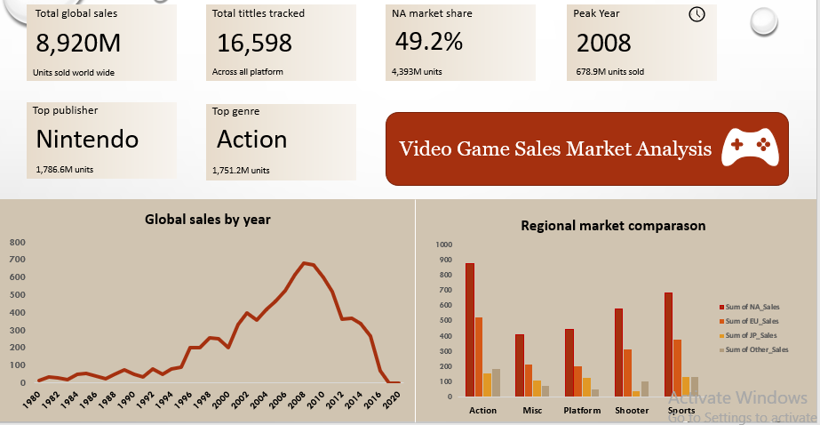
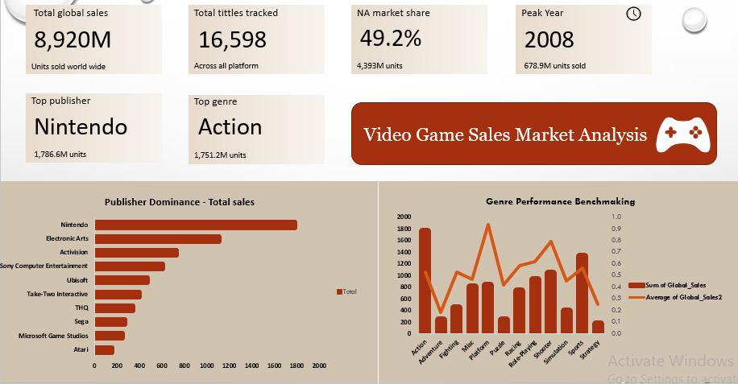
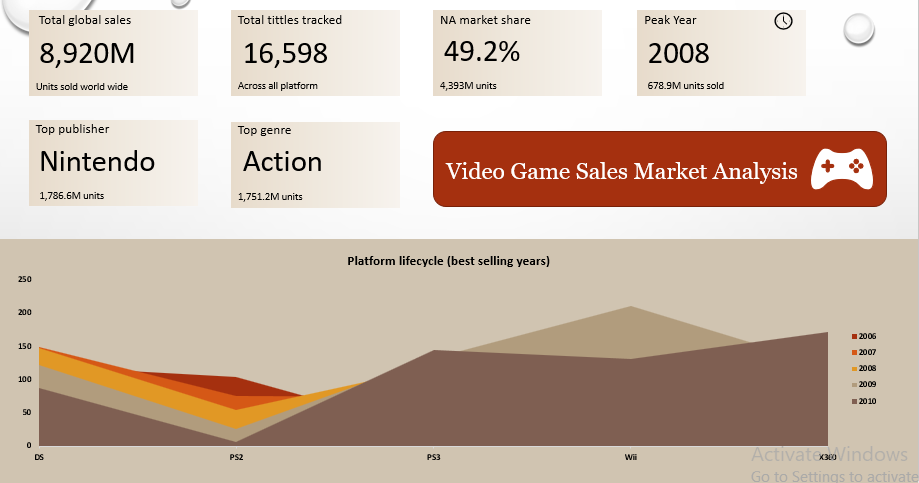

**🎮 Video Game Industry Sales Analysis (1980–2016)

**📊 Overview**

This project presents a comprehensive analysis of the global video game industry using historical sales data from VGChartz, spanning 1980 to 2016.
The dataset includes:
* 16,598 titles
* 31 platforms
* 578 publishers
* 12 genres
* 8,920 million units sold

**The goal is to uncover key industry trends, performance drivers, and strategic insights using Excel-based analytics.**

**🎯 Objectives**

1. Identify top-performing genres, platforms, and publishers
2. Analyze regional demand patterns (NA, EU, Japan, Other)
3. Track industry growth and decline over time
4. Compare publisher performance (volume vs efficiency)
5. Evaluate platform lifecycle trends
6. Provide data-driven business recommendations

**🛠️ Tools & Technologies**

* Microsoft Excel
* Pivot Tables & Pivot Charts
* Excel Functions (SUMIF, AVERAGEIF, COUNTIF)
* Data Visualization

**🗂️ Dataset**

Timeframe: 1980–2016
Metrics include:

* Regional Sales (NA, EU, JP, Other)
* Global Sales (Total, in millions)
* Genre, Platform, Publisher, Year

**🧹 Data Cleaning**

* Handled missing values (271 missing years excluded from time analysis)
* Verified data types and consistency
* Removed formatting inconsistencies
* Created calculated fields (e.g., average sales per title)
* Built structured pivot tables for analysis

**📈 Key Metrics**

**Metric	Value**

1. Total Global Sales	8,920M units
2. Peak Year	2008 (678.9M units)
3. Top Publisher	Nintendo (1,786.6M units)
4. Top Genre (Volume)	Action (1,751.2M units)
5. Best Genre (Efficiency)	Platform (0.94M avg/title)
6. Largest Market	North America (49.2%)
7. Industry Decline	-61% (2008–2015)

**📊 Dashboard Insights**

**1. Industry Trend**

* Growth: 1980–2008
* Peak: 2008
* Decline: Post-2008 (shift to digital & mobile)
  
 

**2. Regional Distribution**

* North America = 49% of global sales
* EU second, Japan niche but strong in RPGs
* Shooter games heavily skewed toward Western markets

**3. Genre Performance**

* Action leads in total sales
* Platform & Shooter lead in avg sales per title
  
 

**4. Publisher Analysis**

* Nintendo dominates in both total sales and efficiency
* Strong evidence of franchise-driven success

 

**5. Platform Lifecycle (2006–2010)**

* Wii dominates short-term
* Xbox 360 & PS3 show steady long-term growth

**🔍 Key Insights**

 1.🎯 Nintendo leads structurally (high per-title performance)

 2. 🌍 North America is the core market

 3. 📉 Post-2008 decline reflects industry shift, not true demand drop

 4. 💰 Platform & Shooter genres offer best ROI

 5. ⚠️ Adventure & Strategy underperform

**🚀 Strategic Recommendations**

1. Prioritize North America for launches

2. Invest in high-ROI genres (Platform, Shooter)

3. Align content with regional preferences

4. Focus on franchise/IP development

5. Supplement analysis with digital sales data

**🧠 Conclusion**

 **The video game industry is shaped by:**
 
* Strong regional demand patterns
* The power of franchise models (Nintendo)
* Differences in genre profitability
* A major shift from physical → digital gaming

 **⚠️ Limitation**
This analysis is based on physical retail sales data only. The following limitations should be considered when interpreting the findings
 
 **Post-2012 data is incomplete** 
 
The observed 61% decline in sales between 2008 and 2015 is largely a data artefact. The gaming industry did not shrink — it migrated to digital and mobile channels that this dataset cannot track. Post-2012 figures should not be interpreted as a true market contraction.

⭐If you found this project insightful or would like to collaborate, feel free to connect with me on LinkedIn at Emmanuel Samuel or explore more of my work here.

